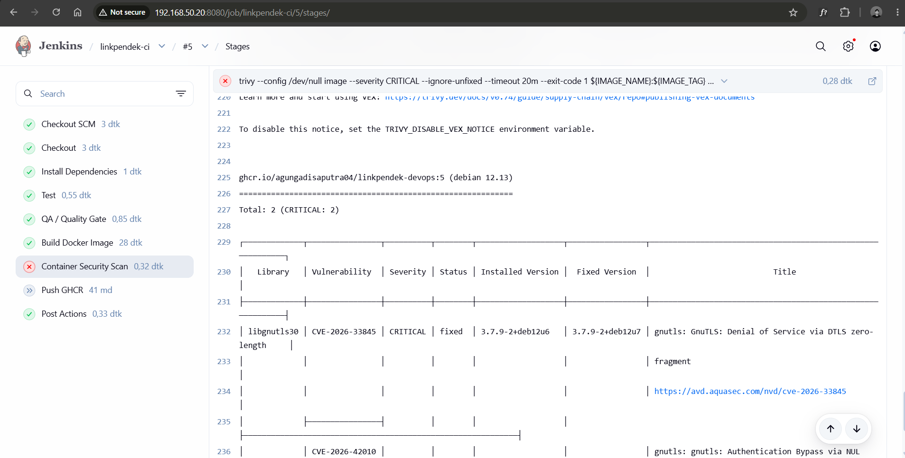
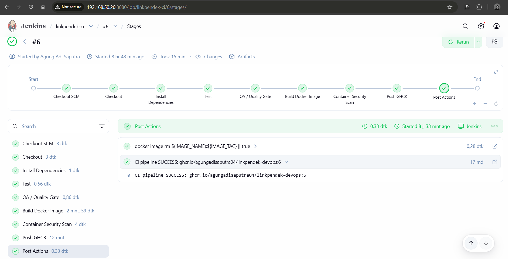

# Container Security Hardening

## Problem

Pada build awal, image LinkPendek gagal di tahap container security scan.

Trivy menemukan sejumlah vulnerability dengan severity `HIGH` dan `CRITICAL`, di antaranya pada package seperti `tar`, `glob`, `minimatch`, `pacote`, dan `sigstore`.

Setelah dependency aplikasi diperiksa ulang lewat `npm ls --all` dan isi `package-lock.json`, ternyata package-package tersebut bukan berasal dari dependency aplikasi. Dependency production aplikasi hanya `express`, `ioredis`, `pg`, dan `prom-client` — semuanya bersih tanpa temuan.

Sumber sebenarnya adalah npm CLI bawaan base image, yang ikut ter-scan karena masih ada di dalam image meski tidak pernah dieksekusi aplikasi. Selain itu, scan juga menemukan vulnerability pada package OS dari base image Debian.



## What I changed

Dockerfile sebelumnya menggunakan satu stage untuk build sekaligus runtime:

```dockerfile
FROM node:20-bookworm-slim

COPY package*.json ./
RUN npm ci --omit=dev

...

CMD ["npm", "run", "start:api"]
```

Dengan pendekatan ini, seluruh isi npm CLI (termasuk dependency internalnya) ikut terbawa ke image final. Solusinya adalah memisahkan proses instalasi dependency dan runtime menjadi dua stage.

**Stage pertama** hanya digunakan untuk memasang production dependency:

```dockerfile
FROM node:20-bookworm-slim AS deps

WORKDIR /app

COPY package*.json ./

RUN npm ci --omit=dev
```

**Stage runtime** dipisah sepenuhnya. Di sini package OS di-upgrade untuk menutup vulnerability yang sudah tersedia fix-nya, dan tooling package manager yang tidak dibutuhkan aplikasi saat runtime dihapus:

```dockerfile
FROM node:20-bookworm-slim AS runtime

ENV NODE_ENV=production

WORKDIR /app

RUN apt-get update \
    && apt-get upgrade -y \
    && apt-get clean \
    && rm -rf /var/lib/apt/lists/*

RUN rm -rf /usr/local/lib/node_modules/npm \
           /usr/local/lib/node_modules/corepack \
           /opt/yarn-* \
           /usr/local/bin/npm \
           /usr/local/bin/npx \
           /usr/local/bin/corepack \
           /usr/local/bin/yarn \
           /usr/local/bin/yarnpkg
```

Hanya production dependency dan file yang benar-benar dibutuhkan aplikasi yang dibawa ke image final:

```dockerfile
COPY --from=deps --chown=node:node /app/node_modules ./node_modules
COPY --chown=node:node src ./src
COPY --chown=node:node scripts ./scripts
COPY --chown=node:node db ./db
COPY --chown=node:node public ./public
COPY --chown=node:node package*.json ./
```

Container tetap berjalan sebagai user non-root (`node`), dan aplikasi dijalankan langsung lewat Node.js tanpa melalui npm:

```dockerfile
USER node

CMD ["node", "src/server.js"]
```

Dengan begitu, npm hanya dibutuhkan pada saat build — bukan saat aplikasi berjalan di production.

## Security Gate di Jenkins

Setelah image selesai di-build, Jenkins menjalankan Trivy sebagai bagian dari pipeline, bukan pemeriksaan manual setelahnya.

CRITICAL vulnerability yang sudah punya fix dijadikan blocking gate — pipeline berhenti di sini kalau ditemukan:

```bash
trivy --config /dev/null image \
    --severity CRITICAL \
    --ignore-unfixed \
    --timeout 20m \
    --exit-code 1 \
    ${IMAGE_NAME}:${IMAGE_TAG}
```

Untuk HIGH dan CRITICAL secara keseluruhan, pipeline juga menghasilkan laporan lengkap yang disimpan sebagai Jenkins artifact, tanpa menggagalkan build:

```bash
trivy --config /dev/null image \
    --severity HIGH,CRITICAL \
    --timeout 20m \
    --exit-code 0 \
    --format table \
    ${IMAGE_NAME}:${IMAGE_TAG} > trivy-full-report.txt
```

Dengan konfigurasi ini, vulnerability yang benar-benar perlu memblokir deployment menjadi gate wajib, sementara temuan lain tetap terdokumentasi dan bisa ditinjau tanpa menghambat rilis.

## Result

Setelah perubahan Dockerfile, Jenkins build `#6` berhasil melewati seluruh stage pipeline:

```text
Checkout SCM             PASS
Install Dependencies     PASS
Test                     PASS
QA / Quality Gate        PASS
Build Docker Image       PASS
Container Security Scan  PASS
Push GHCR                PASS
```

Image berhasil dipublish ke GHCR:

```text
ghcr.io/agungadisaputra04/linkpendek-devops:6
```



## Takeaway

Masalah ini tidak bisa diselesaikan dengan menambahkan package yang dilaporkan Trivy ke `package.json` — package tersebut memang bukan bagian dari dependency aplikasi.

Setelah dependency aplikasi dipastikan bersih, fokus perbaikan dipindahkan ke image